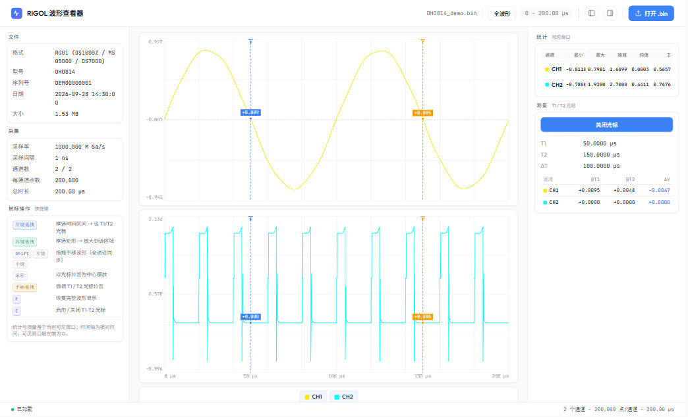

# RIGOL Waveform Viewer

> A single-file, zero-dependency viewer for RIGOL oscilloscope `.bin` captures. Double-click `index.html` — no install, no build step, and the scope doesn't need to be plugged in.

[](LICENSE)
[]()
[]()

[简体中文](README.md) · English



## Why

RIGOL scopes can save a capture as `.bin`, but the official way to look at one means either keeping the instrument connected or having UltraVision installed. Sharing a capture with a colleague, or revisiting a fault captured months ago, is awkward.

This tool parses `.bin` right in the browser: **no server, no dependencies, no build step, and the file never leaves your machine.**

## Features

- **Zero dependencies, zero build** — the whole app is one `index.html`; open it over `file://` and it runs.
- **Three formats** — `RG01` / `RG02` / `RG03`, covering DS1000Z, MSO5000, DS7000, DHO800, DHO1000, DS8000, MSO8000 and friends.
- **Stays smooth at millions of points** — LTTB (Largest-Triangle-Three-Buckets) downsampling preserves spikes and shape instead of averaging them away.
- **Channels stay in sync** — every channel shares one time window, so zoom and pan align and you can compare inter-channel delays directly.
- **Drag to measure** — left-drag a region to drop the T1/T2 cursors there; right-drag a region to zoom into it.
- **Stats follow the view** — the min / max / peak-to-peak / mean / σ table is computed over the **visible window**, not the whole record. That's the number you actually want when you've zoomed in on a glitch.
- **Per-channel cursor readings** — voltage at T1 and T2 plus ΔV for every channel at a glance.
- **Adaptive time axis** — tick precision tightens as you zoom, so you never get five identical `0.00 ms` labels.
- **Channel visibility** — click the legend to show or hide a channel.
- **Fully local** — all parsing happens in the browser; the `.bin` is never uploaded anywhere.

## Quick start

```bash
git clone https://github.com/miaoxiaohu/rigol-waveform-viewer.git
cd rigol-waveform-viewer
```

Open `index.html` in a browser and drop a `.bin` file in.

No scope handy? The repo ships a generator that produces a fully valid synthetic waveform:

```bash
node tools/make-sample-bin.js        # writes sample/DHO814_demo.bin
node tools/verify-sample.js          # verifies it parses with index.html's own parser
```

> `tools/verify-sample.js` extracts the parser straight out of `index.html` and runs it, so the generator and the viewer can never drift apart — change one without the other and the check fails immediately.

## Controls

### Mouse

| Action | Result |
| --- | --- |
| Left-drag | Box-select a time range → sets the T1/T2 cursors |
| Right-drag | Box-select a rectangle → zooms into that region |
| Middle-drag / `Shift` + left-drag | Pan (all channels move together) |
| Wheel | Zoom around the center of the current view |
| Drag the top triangle handles | Fine-tune the T1 / T2 cursors |
| Click a legend item | Show / hide that channel |

### Keyboard

| Key | Result |
| --- | --- |
| `F` | Restore the full waveform |
| `C` | Toggle the T1/T2 cursors |

> Statistics and measurements are computed over the **visible window**. The time axis is relative: the left edge of the visible window is always `0`.

## Supported file format

`.bin` is a proprietary format with no public documentation. The layout below was reverse-engineered and is everything the viewer relies on:

**File header (fixed 128 bytes)**

| Offset | Size | Meaning |
| --- | --- | --- |
| `0x00` | 4 B | Cookie: `RG01` / `RG02` / `RG03` |
| `0x04` | 4 B | uint32, total file length |
| `0x0C` | 4 B | uint32, channel count |
| `0x10` | 4 B | uint32, per-channel header size (140 for RG03) |
| `0x1C` | 4 B | uint32, sample count per channel |
| `0x30` | 8 B | float64, `x_increment` (seconds per sample) |
| `0x00`–`0xFF` | ASCII | Model, serial, date, time (extracted by regex) |

**Channel blocks**

From `0x80` onward the viewer scans for `CH1\0` … `CH4\0` markers. For each marker, the sample data starts at `marker position + per-channel header size` and runs for `sample count × 4` bytes as little-endian float32.

**Cookie → series**

| Cookie | Series |
| --- | --- |
| `RG01` | DS1000Z / MSO5000 / DS7000 |
| `RG03` | DHO800 / DHO1000 |
| `RG02` | DS8000 / MSO8000 |

## Known limitations

Stating these is better than hiding them:

- **Only `CH1`–`CH4` are detected** — the marker scan stops there, so files with more channels won't show CH5 and beyond.
- **Samples with |value| > 100 are set to `NaN`** — deliberate: header/trailer ASCII bytes between channel blocks routinely decode as plausible float32 voltages (`'C'` = `0x43` becomes ~70), which shows up as phantom spikes at the end of a trace. If you're measuring genuinely high voltages (> 100 V), this threshold needs raising.
- **No vertical offset or probe-ratio scaling** — you see the raw voltage values stored in the file.
- **`.bin` only** — CSV, RTF and other export formats aren't handled.
- **The time axis is relative** — the left edge of the visible window is always 0, not an absolute position in the record.

## Layout

```
rigol-waveform-viewer/
├── index.html            # the entire app (parser + renderer + interaction)
├── tools/
│   ├── make-sample-bin.js    # generate a synthetic RIGOL .bin test file
│   └── verify-sample.js      # verify it against index.html's own parser
├── docs/
│   └── screenshot.png
└── LICENSE
```

## Development

Edit and refresh — there's no build step.

```bash
npm run sample     # generate the sample waveform
npm run verify     # check that the sample parses correctly
```

## Contributing

Issues and PRs are welcome, especially:

- Real captures from more models / formats (header layouts may differ across generations)
- Fixes for any of the limitations above

## Credits

RIGOL is a registered trademark of RIGOL Technologies. This project is not affiliated with or endorsed by them — it's an independent third-party viewer.

## License

[MIT](LICENSE)
